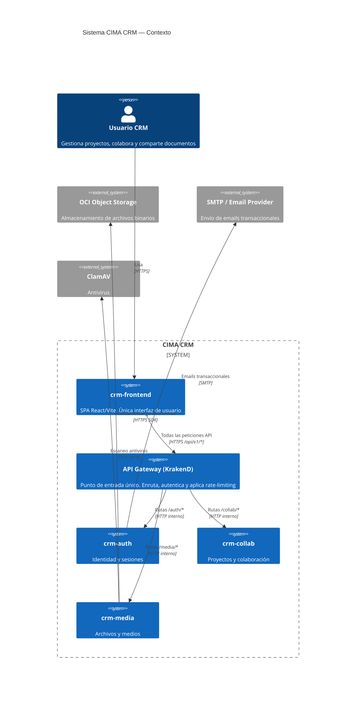
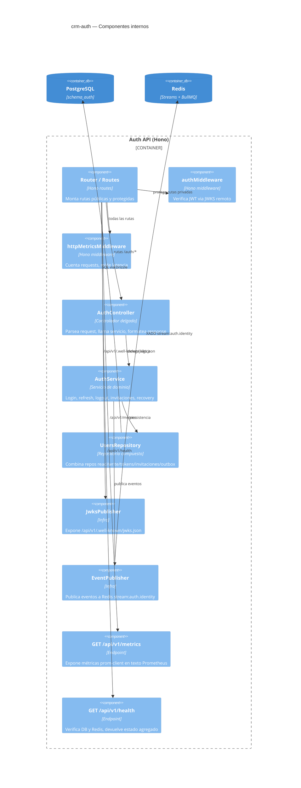
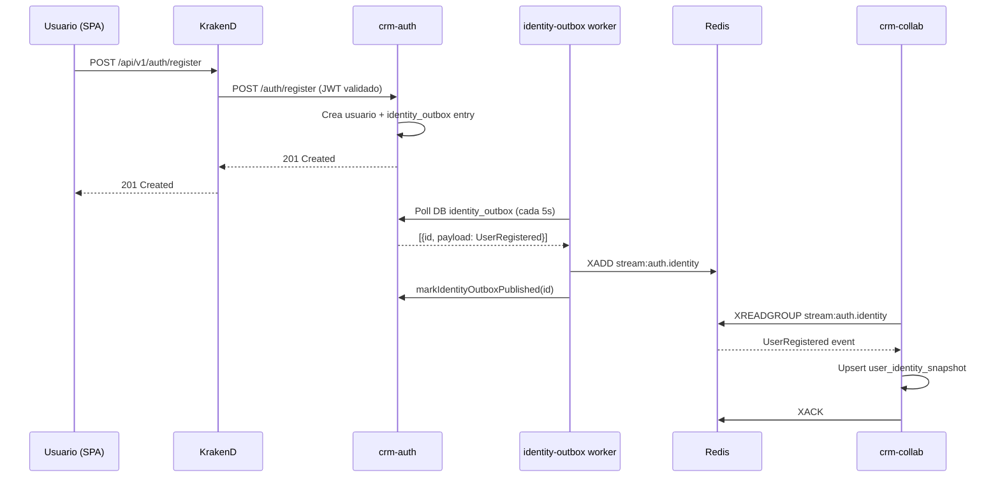

# Arquitectura CIMA CRM — Diagrama C4

## Nivel 1: Contexto del Sistema

---

## Nivel 2: Contenedores

```mermaid
C4Container
  title CIMA CRM — Contenedores

  Person(usuario, "Usuario CRM")

  Container_Boundary(frontend_bound, "crm-frontend") {
    Container(spa, "SPA", "React 18 + Vite + TanStack Query", "UI de autenticación, colaboración y medios")
    Container(nginx, "Nginx", "Servidor web / proxy", "Sirve el SPA y proxea /api al gateway")
  }

  Container_Boundary(infra, "crm-infra (orquestador)") {
    Container(krakend, "KrakenD", "API Gateway", "Enrutamiento, validación JWT, rate-limiting, circuit-breaker")
    ContainerDb(postgres, "PostgreSQL 16", "RDBMS", "Schemas: schema_auth, schema_collab, schema_media")
    ContainerDb(redis, "Redis 7 (AOF)", "Broker / Cache", "Redis Streams, BullMQ, rate-limiting")
    Container(prometheus, "Prometheus", "Métricas", "Scrape de /api/v1/metrics en todos los servicios")
    Container(loki, "Loki", "Logs", "Agregador de logs de contenedores")
    Container(grafana, "Grafana", "Observabilidad", "Dashboard CIMA CRM Overview")
  }

  Container_Boundary(auth_bound, "crm-auth") {
    Container(auth_api, "Auth API", "Hono + Node.js 22", "Login, refresh, JWKS, invitaciones, auditoría")
    Container(identity_worker, "identity-outbox worker", "Node.js", "Publica eventos de identidad al stream")
    Container(email_worker, "email worker", "Node.js + BullMQ", "Envío de emails transaccionales")
    Container(cleanup_worker, "token-cleanup worker", "Node.js", "Limpieza periódica de tokens expirados")
  }

  Container_Boundary(collab_bound, "crm-collab") {
    Container(collab_api, "Collab API", "Hono + Node.js 22", "Proyectos, tareas, chat, membresías, cambios")
    Container(collab_worker, "collab-outbox worker", "Node.js", "Publica eventos de collab al stream")
  }

  Container_Boundary(media_bound, "crm-media") {
    Container(media_api, "Media API", "Hono + Node.js 22", "Avatares, documentos, URLs pre-firmadas")
    Container(media_worker, "media-command worker", "Node.js", "Procesa comandos de collab via Redis Stream")
    Container(quarantine_worker, "quarantine-scan worker", "Node.js", "Escaneo antivirus de archivos nuevos")
  }

  System_Ext(oci, "OCI Object Storage")
  System_Ext(smtp, "SMTP Provider")

  Rel(usuario, nginx, "HTTPS")
  Rel(nginx, krakend, "/api proxy", "HTTP")
  Rel(nginx, spa, "Sirve SPA")
  Rel(krakend, auth_api, "JWT validation + routing")
  Rel(krakend, collab_api, "routing")
  Rel(krakend, media_api, "routing")
  Rel(auth_api, postgres, "schema_auth")
  Rel(auth_api, redis, "BullMQ email-queue")
  Rel(identity_worker, postgres, "identity_outbox")
  Rel(identity_worker, redis, "stream:auth.identity XADD")
  Rel(email_worker, redis, "BullMQ BRPOP")
  Rel(email_worker, smtp, "SMTP")
  Rel(collab_api, postgres, "schema_collab")
  Rel(collab_api, redis, "stream:collab.media-commands XADD")
  Rel(collab_worker, postgres, "collab_outbox")
  Rel(collab_worker, redis, "stream:collab.events XADD")
  Rel(media_worker, redis, "stream:collab.media-commands XREADGROUP")
  Rel(media_worker, redis, "stream:media.asset-responses XADD")
  Rel(media_api, postgres, "schema_media")
  Rel(media_api, oci, "PUT/GET objects")
  Rel(quarantine_worker, postgres, "quarantine_files")
  Rel(prometheus, auth_api, "GET /api/v1/metrics")
  Rel(prometheus, collab_api, "GET /api/v1/metrics")
  Rel(prometheus, media_api, "GET /api/v1/metrics")
  Rel(loki, auth_api, "logs via promtail")
  Rel(grafana, prometheus, "datasource")
  Rel(grafana, loki, "datasource")
```

---

## Nivel 3: Componentes (crm-auth como ejemplo)

---

## Flujos de eventos cross-servicio

---

## Decisiones de arquitectura clave (ADRs simplificados)

| # | Decisión | Alternativa rechazada | Motivo |
|---|----------|-----------------------|--------|
| 1 | Un schema de DB por servicio, sin FK cruzadas | Schema único compartido | Desacoplamiento deploy |
| 2 | Validación JWT via JWKS remoto (cacheado) | Trust headers del gateway | No depende de que el gateway valide |
| 3 | Outbox pattern para eventos | RPC síncrono entre servicios | Durabilidad y desacoplamiento temporal |
| 4 | JWT de servicio (RSA por par) para comandos crm-collab → crm-media | HMAC compartido | No requiere secreto compartido |
| 5 | Composición de datos en cliente (TanStack Query) | BFF de composición server-side | Eliminó una capa de acoplamiento |
| 6 | prom-client /api/v1/metrics + Prometheus + Grafana | Métricas ad-hoc en Redis | Estándar de industria, alertas nativas |
| 7 | Redis Streams + consumer groups para eventos | BullMQ para todos los eventos | Retencion de historia, replay posible |
