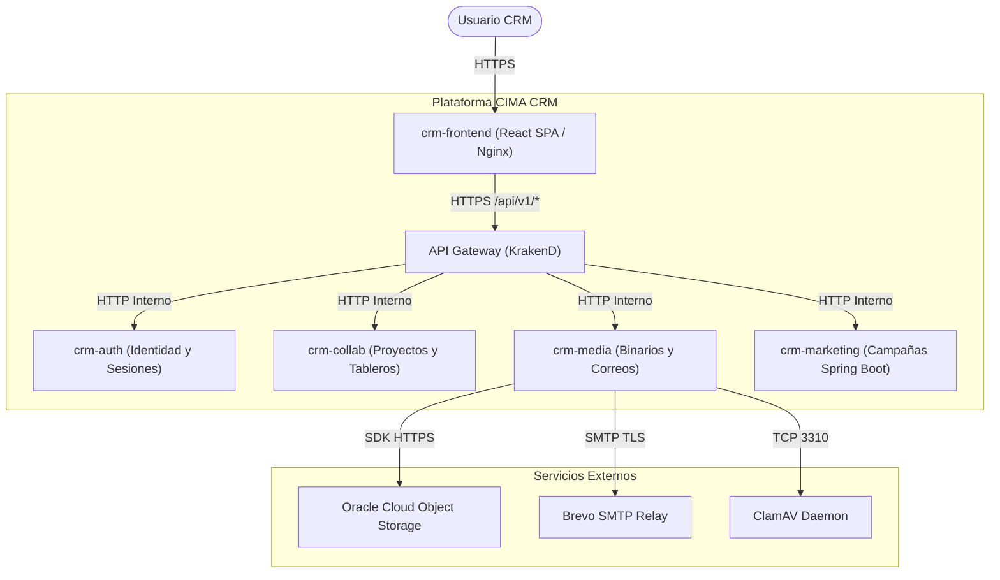

# Arquitectura de Plataforma: `crm-infra`

Este documento describe la topología de contenedores, la segmentación de redes, los componentes de datos compartidos y los modelos de interacción de CIMA CRM.

---

## 1. Topología del Sistema (Diagrama C4 Nivel 1)



---

## 2. Contenedores y Servicios de Infraestructura

La infraestructura se orquesta mediante Docker Compose sobre una red interna segura (`shared_backplane` en local, `crm-network` en producción).

```text
┌────────────────────────────────────────────────────────────────────────┐
│                          Red: shared_backplane                         │
├──────────────────┬─────────────────┬─────────────────┬─────────────────┤
│    KrakenD       │   PostgreSQL    │      Redis      │     ClamAV      │
│  (API Gateway)   │   (RDBMS 16)    │   (Broker 7)    │   (Antivirus)   │
│  Puerto: 28080   │  Puerto: 25432  │  Puerto: 26379  │  Puerto: 23310  │
└────────┬─────────┴────────┬────────┴────────┬────────┴────────┬────────┘
         │                  │                 │                 │
         │                  │                 │                 │
┌────────┴─────────┐ ┌──────┴─────────┐ ┌─────┴─────────┐ ┌─────┴─────────┐
│     crm-auth     │ │   crm-collab   │ │   crm-media   │ │ crm-marketing │
│   Puerto: 3000   │ │  Puerto: 3001  │ │  Puerto: 3002 │ │  Puerto: 3003 │
│  (schema_auth)   │ │ (schema_collab)│ │ (schema_media)│ │ (schema_mkt)  │
└──────────────────┘ └────────────────┘ └───────────────┘ └───────────────┘
```

---

## 3. Principios de Segregación de Datos

1. **Instancia Única de PostgreSQL con Schemas Lógicos**:
   - En lugar de levantar múltiples contenedores de base de datos que malgasten recursos de RAM y conexiones, se utiliza un único clúster PostgreSQL 16.
   - Cada microservicio posee su propio esquema relacional (`schema_auth`, `schema_collab`, `schema_media`, `schema_marketing`) y su propio usuario/contraseña con permisos restringidos exclusivamente a su esquema.
2. **Redis Centralizado con Persistencia AOF**:
   - Unifica la mensajería asíncrona de Redis Streams y las colas BullMQ.
   - Persistencia configurada con Append-Only File (`appendonly yes`, `appendfsync everysec`) para garantizar durabilidad ante reinicios.
3. **Escáner Antivirus ClamAV Compartido**:
   - Servicio daemon accesible por socket TCP en el puerto interno 3310, consumido por `crm-media` tanto síncronamente como en workers en segundo plano.

---

## 4. Topología de Red y Aislamiento

- **Red Externa (Ingress)**: Únicamente el API Gateway (`28080` / `8080`) y el servidor web frontend (`5173` / `80` / `443`) exponen puertos al exterior en entornos productivos.
- **Red Interna (Backplane)**: Los microservicios (`3000`, `3001`, `3002`, `3003`) y los almacenes de datos no deben exponer puertos a redes públicas en producción; se comunican a través del DNS interno de Docker.
- **Trazabilidad de Red**: Las peticiones que ingresan por KrakenD reciben un `X-Trace-Id` que se propaga por todos los saltos internos de red y se imprime en los logs de Pino y Loki.
